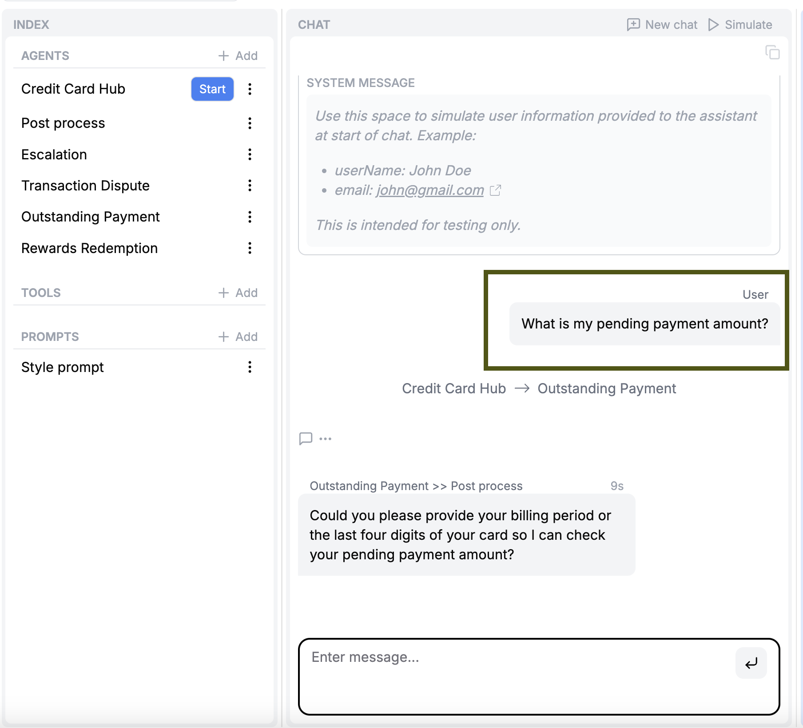

# Using the Hosted App

- This is the developers guide to self-hosting the open-source version of RowBoat.
- Please see our [Introduction](/) page before referring to this guide.
- For direct installation steps, please head to the README of RowBoat's Github repo: [@rowboatlabs/rowboat](https://github.com/rowboatlabs/rowboat/). This page provides more context about the installation process and the different components involved. 

## Overview

RowBoat's codebase has three main components:

| Component | Description |
|--------------|---------------|
| **Agents** | Python framework responsible for carrying out multi-agent conversations |
| **Copilot** | Python framework powering the copilot in RowBoat Studio |
| **RowBoat** | Frontend and backend services to power RowBoat Studio and Chat APIs |

These components are structured as separate services, each containerized with Docker. Running `docker-compose up --build` enables you to use the Studio in your browser, as well as stands up the APIs and SDK. 

## Prerequisites
All of these prerequistes have open-source or free versions.

| Prerequisite | Description |
|--------------|---------------|
| **Docker** | Bundles and builds all services |
| **OpenAI API Key** | Agents and Copilot services are powered by OpenAI LLMs |
| **MongoDB** | Stores workflow versions, chats and RAG embeddings |
| **Auth0 Account** | Handles user authentication and identity management for Studio |

Refer to our [Github Readme for Prerequisites](https://github.com/rowboatlabs/rowboat/?tab=readme-ov-file#prerequisites) to set up prerequisites.

## Setting up

Refer to our [Github Readme for Local Development](https://github.com/rowboatlabs/rowboat/?tab=readme-ov-file#local-development-setup) to set up Studio, Chat API and SDK via `docker-compose`. 

### Testing Studio

1. Once you are set up, you should be able to login to the Studio (default local URL: [http://localhost:3000](http://localhost:8000)) via Auth0's login options (Gmail, Github etc.)
<br>

2. Once in Studio, create a new blank project or use one of the example templates:

<br>

3. Use the copilot to help you build agents:

<br>

4. Ensure that the correct agent is set as the "start agent":

<br>

5. Test out a chat in the playground to verify the agents' behavior:

<br>

### Testing the Chat API

You can use the API directly at [http://localhost:3000/api/v1/](http://localhost:3000/api/v1/)
- Project ID is available in the URL of the project page
- API Key can be generated from the project config page at `/projects/<PROJECT_ID>/config`

Below is an example request and response. Modify the user message in the request, based on your example project.

**Request:**

```bash
curl --location 'http://localhost:3000/api/v1/<PROJECT_ID>/chat' \
--header 'Content-Type: application/json' \
--header 'Authorization: Bearer <API_KEY>' \
--data '{
    "messages": [
        {
            "role": "user",
            "content": "What is my pending payment amount?"
        }
    ]
}'
```
**Response:**
The last message in `messages` is either a user-facing response or a tool call by the assistant.

```json
{
    "messages": [
        {
            "sender": "Credit Card Hub",
            "role": "assistant",
            "response_type": "internal",
            "content": null,
            "created_at": "2025-02-01T06:55:47.843909",
            "current_turn": true,
            "tool_calls": [
                {
                    "function": {
                    "arguments": "{\"args\":\"\",\"kwargs\":\"\"}",
                    // Internal tool calls are used to transfer between agents
                    "name": "transfer_to_outstanding_payment"
                    },
                    "id": "call_7jGpwpVvzhZFOyRgxHFkdOdU",
                    "type": "function"
                }
            ]
        },
        {
            "tool_name": "transfer_to_outstanding_payment",
            "role": "tool",
            "content": "{\"assistant\": \"Outstanding Payment\"}",
            "tool_call_id": "call_7jGpwpVvzhZFOyRgxHFkdOdU"
        },
        {
            "sender": "Outstanding Payment",
            "role": "assistant",
            // Response is not user-facing, to enable further post processing
            "response_type": "internal",
            "content": "Sure, could you provide the last four digits of your card or your registered mobile number so I can look up your pending payment amount?",
            "created_at": "2025-02-01T06:55:49.648008",
            "current_turn": true
        },
        {
            "sender": "Outstanding Payment >> Post process",
            "role": "assistant",
            // Response is user-facing
            "response_type": "external",
            "content": "Sure, please provide the last four digits of your card or your registered mobile number so I can check your pending payment amount.",
            "created_at": "2025-02-01T06:55:49.648008",
            "current_turn": true
        }
    ],
    "state": {
        // .. state data
    }
}
```

### Testing the Python Chat SDK

```bash
pip install rowboat
```

Modify the user message in `messages`, based on your example project.

```python
from rowboat import Client

client = Client(
    host="http://localhost:3000",
    project_id="<PROJECT_ID>",
    api_key="<API_KEY>"  # Generate this from /projects/<PROJECT_ID>/config
)

# Simple chat interaction
messages = [{"role": "user", "content": "What is my pending payment amount?"}]
response_messages, state = client.chat(messages=messages)
```
The last message in `response_messages` is either a user-facing response or a tool call by the assistant.