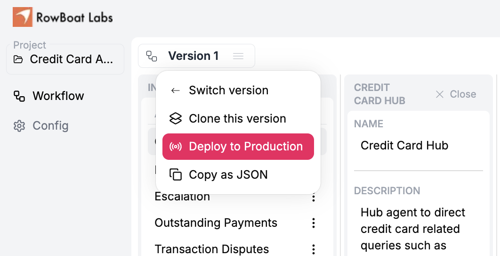
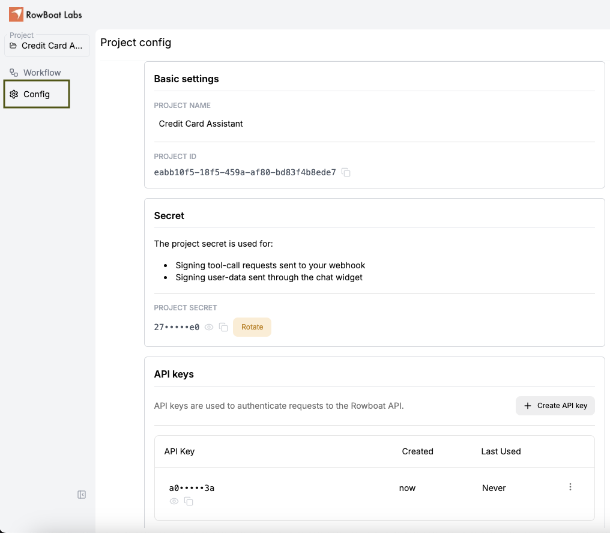

# Using the API

This is a guide on using the HTTP API to power conversations with the assistant created in Studio.

## Deploy your assistant to production on Studio


## Obtain API key and Project ID

Generate API keys via the developer configs in your project. Copy the Project ID from the same page.


## Call the API

When you provide your Project ID in the API call, RowBoat uses the version of your assistant deployed to production. 

The API takes as input: a) history of all `messages` till now (system, user, tool and assistant messages) and b) `state` generated from the previous turn (this is needed because the API does not maintain state on its own). 

The API produces as response: a) `messages`, which are the assistant responses (user-facing responses or tool calls) for the current turn and b) the `state` to be passed to the next turn. The last message in `messages` is either a user-facing response or a tool call by the assistant. 

### Example first turn of a chat

#### Request

```bash
curl --location 'http://localhost:3000/api/v1/<PROJECT_ID>/chat' \
--header 'Content-Type: application/json' \
--header 'Authorization: Bearer <API_KEY>' \
--data '{
    "messages": [
        {
            "content": "UserID: 345227",
            "role": "system"
            // Provide context to be passed to all agents in the assistant
            // E.g. user identity info (user ID) for logged in users
        },
        {
            "content": "What is my outstanding balance and how do I make the payment?",
            "role": "user"
        }
    ],
    "state": {
        "last_agent_name": "Credit Card Hub"
        // This the last agent used in the previous turn.
        // Set to the "start agent" for first turn of chats
    }
}'
```
#### Response
```json
{
    "messages": [
        {
            "role": "assistant",
            "sender": "Credit Card Hub",
            "content": null,
            "created_at": "2025-02-03T05:22:30.194879",
            "current_turn": true,
            "response_type": "internal",
            "tool_calls": [
                {
                  "function": {
                    "name": "transfer_to_outstanding_payments",
                    "arguments": "{\"args\":\"\",\"kwargs\":\"\"}"
                  },
                  "id": "call_SLyQKXt9ZMqnxSqJjo9j1fU5",
                  "type": "function"
                }
            ]
        },
        {
          "tool_name": "transfer_to_outstanding_payments",
          "role": "tool",
          "content": "{\"assistant\": \"Outstanding Payments\"}",
          "tool_call_id": "call_SLyQKXt9ZMqnxSqJjo9j1fU5"
        },
        {
            "role": "assistant",
            "sender": "Outstanding Payments",
            "content": null,
            "created_at": "2025-02-03T05:22:30.716012",
            "current_turn": true,
            "response_type": "internal",
            "tool_calls": [
                {
                  "function": {
                    "name": "get_outstanding_balance",
                    "arguments": "{\"user_id\":\"345227\"}"
                  },
                  "id": "call_MNAUg7UTszYMt5RL4n5QqUTw",
                  "type": "function"
                }
            ]
        }
    ],
    "state": {
        "agent_data": [
            // agents that were involved in this turn
            {
                "name": "Credit Card Hub",
                "instructions": "// agent instructions",
                "history": [ 
                  // history of agent-relevant messages
                  // in the same format as "messages"
                ],
                "internal_tools": [],
                "external_tools": [],
                "child_functions": [
                  "transfer_to_outstanding_payments",
                  "transfer_to_transaction_disputes",
                  "transfer_to_rewards_redemption"
                ],
                "most_recent_parent_name": "",
                "parent_function": null
            },
            {
                "name": "Outstanding Payments",
                "instructions": // agent instructions,
                "history": [ 
                  // history of agent-relevant messages 
                  // in the same format as "messages"
                ],
                "internal_tools": [],
                "external_tools": [
                  "get_outstanding_balance",
                  "get_saved_credit_card"
                ],
                "child_functions": [],
                "most_recent_parent_name": "",
                "parent_function": null
            },

            // other agents - have not yet participated in the conversation
            {
                "name": "Rewards Redemption",
                "instructions": // agent instructions,
                "history": [], // 
                "internal_tools": [],
                "external_tools": [],
                "child_functions": [],
                "most_recent_parent_name": "",
                "parent_function": null
            },
            {
                "name": "Transaction Disputes",
                "instructions": // agent instructions,
                "history": [],
                "internal_tools": [],
                "external_tools": [],
                "child_functions": [],
                "most_recent_parent_name": "",
                "parent_function": null
            },
            {
                "name": "Escalation",
                "instructions": // agent instructions,
                "history": [],
                "internal_tools": [],
                "external_tools": [],
                "child_functions": [],
                "most_recent_parent_name": "",
                "parent_function": null
            },
        ],
        "last_agent_name": "Outstanding Payments"
    }
}

```

### Example where the assistant is expecting a tool response
#### Request
```bash
curl --location 'http://localhost:3000/api/v1/<PROJECT_ID>/chat' \
--header 'Content-Type: application/json' \
--header 'Authorization: Bearer <API_KEY>' \
--data '{
    "messages": [
        {
            "content": "UserID: 345227",
            "role": "system",
        },
        {
            "content": "What is my outstanding balance and how do I make the payment?",
            "role": "user",
        },
        {
            "content": null,
            "role": "assistant",
            "sender": "Credit Card Hub",
            "tool_calls": [
                {
                "function": {
                    "arguments": "{\"args\":\"\",\"kwargs\":\"\"}",
                    "name": "transfer_to_outstanding_payments"
                },
                "id": "call_SLyQKXt9ZMqnxSqJjo9j1fU5",
                "type": "function"
                }
            ],
            "tool_call_id": null,
            "tool_name": null,
            "response_type": "internal"
        },
        {
            "content": "{\"assistant\": \"Outstanding Payments\"}",
            "role": "tool",
            "sender": null,
            "tool_calls": null,
            "tool_call_id": "call_SLyQKXt9ZMqnxSqJjo9j1fU5",
            "tool_name": "transfer_to_outstanding_payments"
        },
        {
            "content": null,
            "role": "assistant",
            "sender": "Outstanding Payments",
            "tool_calls": [
                {
                "function": {
                    "arguments": "{\"user_id\":\"345227\"}",
                    "name": "get_outstanding_balance"
                },
                "id": "call_MNAUg7UTszYMt5RL4n5QqUTw",
                "type": "function"
                }
            ],
            "tool_call_id": null,
            "tool_name": null,
            "response_type": "internal"
        },
        {
            "content": "{\"result\":{\"outstanding_balance\":\"$250.00\",\"due_date\":\"2025-02-15\",\"payment_methods\":[\"Credit Card\",\"Bank Transfer\",\"PayPal\"]}}",
            "role": "tool",
            "sender": null,
            "tool_calls": null,
            "tool_call_id": "call_MNAUg7UTszYMt5RL4n5QqUTw",
            "tool_name": "get_outstanding_balance"
        },
    ],
    "state": {
        // State returned by the API in the previous turn
    }
}'
```
#### Response
```json
{
    "messages": [
      {
        "content": "Your outstanding balance is $250.00, due by February 15, 2025.\n\nYou have several payment options available, including:\n- **Credit Card**\n- **Bank Transfer**\n- **PayPal**\n\nPlease let me know which option you'd like to use, and I'll guide you through the process!",
        "created_at": "2025-02-03T06:01:07.451140",
        "current_turn": true,
        "response_type": "internal",
        "role": "assistant",
        "sender": "Outstanding Payments"
      },
      {
        "content": "Your outstanding balance is $250.00, due by February 15, 2025. \n\nPayment options include:\n- **Credit Card:** You can use your saved Visa card ending in 1234.\n- **Bank Transfer**\n- **PayPal**\n\nLet me know your preferred payment method, and I’ll assist you!",
        "created_at": "2025-02-03T06:01:07.451140",
        "current_turn": true,
        "response_type": "external",
        "role": "assistant",
        "sender": "Outstanding Payments >> Post process"
      }
    ],
    "state": {
      "agent_data": [
        // Omitted for brevity
      ],
      "last_agent_name": "Outstanding Payments"
    }
}
```